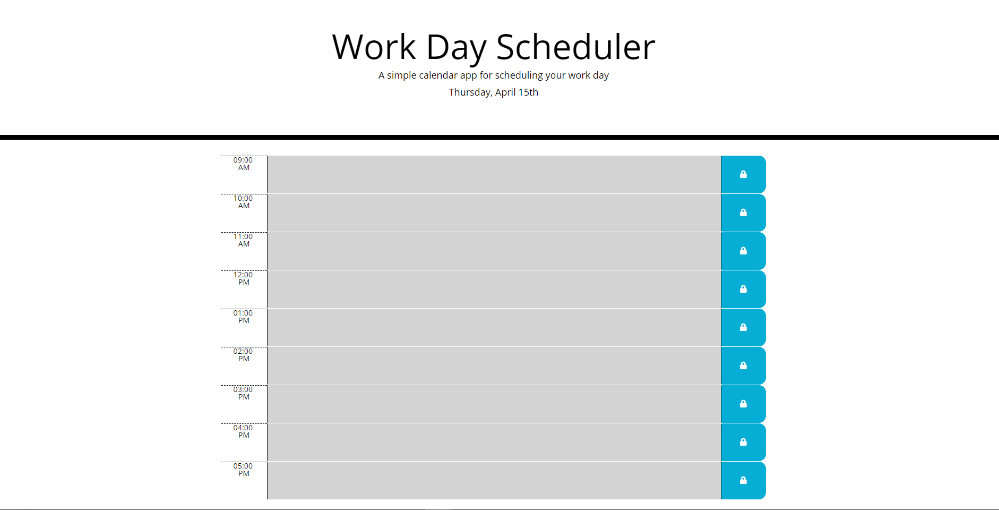

# Work-day-scheduler

## Description
The project was made in order to build a work day scheduler, making it easier for a busy employer to plan for its day to day activities. The advantage of the following scheduler is that allows the user to save the notes in their local storage and keep them display.

## Project status
This project is in its testing phase. 

## Installation
 * Create a repo on GitHub
 * Clone the repo on the computer
 * Create an HTML, CSS and Javascript file
 * Write the HTML and CSS code previously provided
 * Write the jQuery code
 * Use moment in order to select the time and date and display it
 * Use google DevTools in order to inspect if the code is running correctly
 * Pull and commit changes on Github
 * Publish the website on Github pages

## Finished Project

## Link to the website
https://sofiacrf.github.io/Work-Day-Scheduler/
